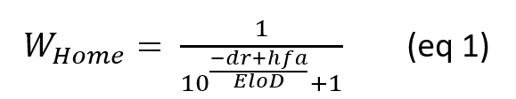
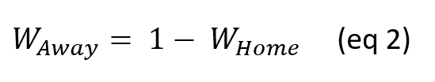
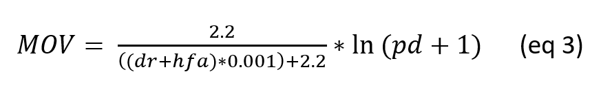
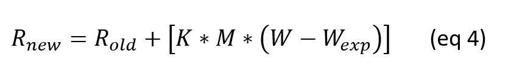
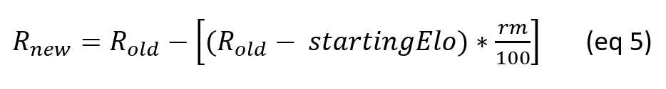

# AUDL historical data visualization and predition tool

 
Navigate to different tabs along the top of the page.  

* `Historical Data` contains all the AUDL games from 2014-2022, and is filterable by team and year.
* `Elo Parameters` defines the parameters used for the visualization and prediction. See more below.
* `Historical Elo Plot` plots the Elo ratings for each team from 2014-2022 based on their results and the parameters in the previous tab. This will auto-update if the parameters are changed.
* `2023 Season Predictions` *Coming Soon.* Will use Elo scores and the 2023 schedule to predict outcomes of games and the season.
* `Game Predictor` *Coming Soon.* Allows for the prediction of any game using the Elo scores.  

# Methodology

* Data: [theAUDL.com](https://theaudl.com/)  
* Elo Method: Based on the [NFL Elo methodology from fivethirtyeight.com](https://fivethirtyeight.com/methodology/how-our-nfl-predictions-work/)  

[Elo ratings](https://en.wikipedia.org/wiki/Elo_rating_system) were originally used to compare relative skills of chess players, but have since been adapted to many other sports. Here I'm using a system that is based off of the NFL elo ratings system from fivethirtyeight, that takes into account home field advantage, margin of victory, strength of opponent, and importance of game.  

Most of the parameters for the Elo calculations can be specified by the user in the `Elo Parameters` tab, with some good defaults already present.  

First, each team starts with an Elo score specified by the user (default 1400). When a new team enters the league, they enter at this level. To predict the outcome of a game, the Elo scores of the two teams are compared against each other. The calculated chance that the home team will win is given by: 

  

Where *WHome* is the winning chance of the home team, *dr* is the difference between the elo scores of the home and away team (home - away), *hfa* is the home field advantage correction (default 100), and *EloD* is the Elo denominator (default 400).

Because ties are generally not allowed in the AUDL, the winning chance of the away team is simply: 

  

After each game, the Elo score of each team is updated based on the outcome of the game. First, several multipliers and modifiers are added. The first is a multiplier based on the importance of a game. Elo scores should change more for more important games. The weights for each type of game (regular season, playoff, semifinal, or final) can be set in the `Elo Parameters` tab. This value is referred to as *K*. Next a margin of victory parameter, *MOV* is calculated based on the point differential in the game. This is calculated using the following equation:  

  

Where *MOV* is the modifier, *dr* and *hfa* are teh same as above, and *pd* is the absolute value of the point differential. The point differential is buried within a logarithmic term, which means that larger and larger point differentials will have proportionally less impact on change in Elo. The difference in Elo rankings between the two team is also considered, which reduces the influence of good teams running up the score against much worse teams. This *MOV* value is then multiplied by a user specified multiplier (default 1) to increase or decrease the influence of point differential on Elo rankings. This can be set in the `Elo Paramters` tab. A multiplier of 0 means that point differential is not factored in to the ratings, and a modifier of 2 means that the point differential is twice as important. This value is referred to as *M*.  

With these modifiers determined, the new Elo score fore each team is calculated using the following equation:  

 

Where the new Elo score for a team is *Rnew*, the previous Elo score for that team is *Rold*, *K* and *M* are the modifiers calculated above, *W* is the actual outcome of the game (1 if the team won, 0 if the team lost, and 0.5 in the rare occasion that there was a tie), and *Wexp* is the predicted outcome for the team, based on equation 1 or 2, depending on if the team is home or away.

A final piece that comes into play, is the regression to the starting Elo value after each season. Teams tend to get shaken up during the offseason, so the starting Elo value of each team for the new season is calculated by the following equation: 

  

Where *Rnew* is the Elo score for the new season, *Rold* is the previous Elo score, *startinElo* is the starting value for each team specified by the user (default 1400), and *rm* is the regression to the mean percentage (default 20%). A value of 0 here will keep each teams previous season Elo as their starting score for the next season, and a value of 100 will return each teams Elo to the default starting value for the new season.  

**By Simon Weaver**  
PhD student, University of Notre Dame
